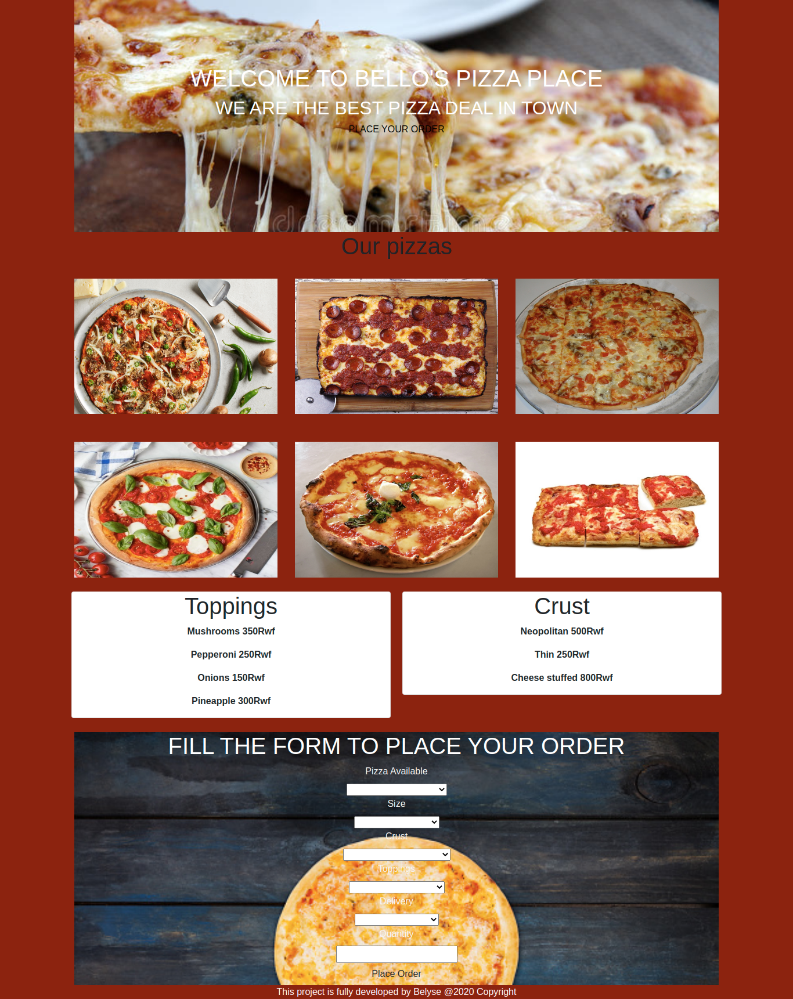

# Bello's Pizza Place
## Author
This is Belyse Uwambayinema
A Moringa Student
### Project Description
This project is about my pizza place that can allow our viewers to order for different pizza of different size they want. Enjoy!!!
## Live Page

## Check out my site
https://ubelyse.github.io/week4project/
### Setup Installation
* Terminal
* Visual Code
* Git
* Clone the repo
* Browser 
### Technologies/Languages
* Html
* Css
* Bootstrap
* Javascript
* Jquerry

### Contributors
Contributions are what make the open source community such an amazing place to be learn, inspire, and create.Any contribution you wish to make are highly appreciated.
1. Fork the project
2. Create your feature branch
3. Commit your changes
4. Push the branch
5. Open Pull request

#### Bugs
 No known bugs

### SUpport and Contact Details
Email me at @ubelyse1@gmail.com
Check out My work @ hhttps://github.com/ubelyse/week4project

### License
Copyright @2020 **Belyse Uwambayinema**
To the extent possible under law, I Belyse have waived all copyright and related or neighboring rights to this work.